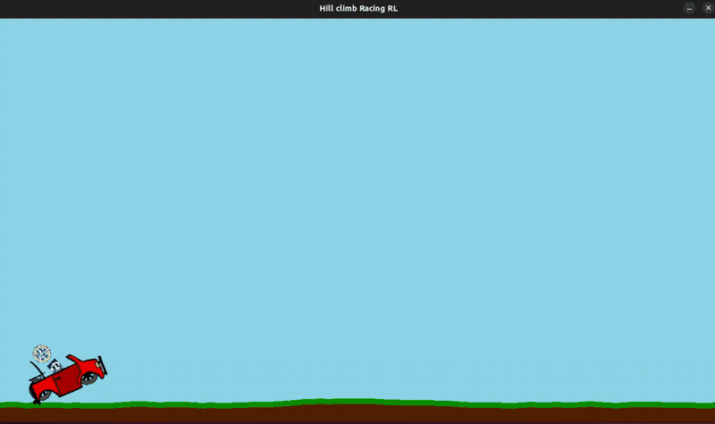

# Hill Climb Racing -- Gymnasium RL Environment

[](https://pypi.org/project/hill-climb-racing-env/)
[](https://www.python.org/downloads/)
[](https://gymnasium.farama.org/)
[](https://www.gnu.org/licenses/gpl-3.0)
[](https://github.com/alexzh3/hillclimbracing)

A reinforcement learning environment for **Hill Climb Racing**, built on [Farama Gymnasium](https://gymnasium.farama.org/) with [Box2D](https://box2d.org/) physics and [Pygame](https://www.pygame.org/) rendering. Train agents using [Stable-Baselines3](https://stable-baselines3.readthedocs.io/) or any Gymnasium-compatible RL library.

Originally developed for a bachelor's [thesis](https://theses.liacs.nl/2953) at Leiden University (LIACS), supervised by Matthias Muller-Brockhausen and Evert van Nieuwenburg. The thesis explores how different action spaces, reward functions, and reward shaping strategies affect PPO agent performance in an HCR-like environment. The best agent -- using a continuous action space with an aggressive wheel-speed-based reward -- achieved a mean score of **773** (out of 1000) in evaluation, and consistently reached the maximum score of 1000 in an environment with increasing difficulty after only 200k training steps. The original experimentation code, training scripts, and result graphs can be found on the [`thesis`](https://github.com/alexzh3/hillclimbracing/tree/thesis) branch.

The game is a Python rewrite of [Code Bullet's Hill Climb Racing AI](https://github.com/Code-Bullet/Hill-Climb-Racing-AI) (JavaScript), with added Gymnasium integration, multiple reward/action configurations, and procedural terrain generation using Perlin noise.



## Table of Contents

- [Features](#features)
- [Installation](#installation)
- [Quick Start](#quick-start)
- [Environment Configuration](#environment-configuration)
- [Observation Space](#observation-space)
- [Action Space](#action-space)
- [Reward Functions](#reward-functions)
- [Human Play Mode](#human-play-mode)
- [Pre-trained Baseline Models](#pre-trained-baseline-models)
- [Testing](#testing)
- [Project Structure](#project-structure)
- [Acknowledgements](#acknowledgements)
- [License](#license)

## Features

- **Gymnasium environment** -- standard `reset()` / `step()` / `render()` API
- **Two action spaces** -- 3-action discrete (idle / gas / reverse) or continuous motor speed
- **Five reward functions** -- distance-based, action-based, wheel-speed-based, and two airtime variants
- **Two reward intensities** -- aggressive or soft penalty shaping
- **Procedurally generated terrain** -- Perlin noise with configurable difficulty
- **Box2D physics** -- realistic car, suspension, ragdoll driver, and collision detection
- **Human play mode** -- play with keyboard via the `hill-climb-play` command
- **Pre-trained baselines** -- 13 PPO models included for comparison

## Installation

This project uses [uv](https://docs.astral.sh/uv/) for dependency management. Install it first if you don't have it:

```bash
# Linux / macOS
curl -LsSf https://astral.sh/uv/install.sh | sh

# Windows
powershell -ExecutionPolicy ByPass -c "irm https://astral.sh/uv/install.ps1 | iex"
```

### Prerequisites

Box2D requires the [SWIG](http://www.swig.org/) build tool:

```bash
# Ubuntu / Debian
sudo apt-get install swig

# macOS
brew install swig

# Windows (via conda)
conda install swig
```

### Install from PyPI

```bash
uv pip install hill-climb-racing-env
uv pip install "hill-climb-racing-env[train]"   # with Stable-Baselines3
```

### Install from source

```bash
git clone https://github.com/alexzh3/hillclimbracing.git
cd hillclimbracing
uv sync
```

To also install [Stable-Baselines3](https://stable-baselines3.readthedocs.io/) for training:

```bash
uv sync --extra train
```

## Quick Start

The snippet below opens a Pygame window, creates the environment with a random agent, and runs it for 2000 steps. The agent picks a random action (idle, gas, or reverse) each frame, so it will drive erratically and crash quickly -- but it's a good way to verify the installation works and see the environment in action.

```bash
uv run python -c "
import gymnasium as gym
import hill_racing_env
env = gym.make('hill_racing_env/HillRacing-v0', render_mode='human')
obs, _ = env.reset(seed=42)
for _ in range(2000):
    obs, reward, terminated, truncated, info = env.step(env.action_space.sample())
    env.render()
    if terminated or truncated:
        obs, _ = env.reset()
env.close()
"
```

Or equivalently in a Python script:

```python
import gymnasium as gym
import hill_racing_env  # registers the environment

env = gym.make("hill_racing_env/HillRacing-v0", render_mode="human")
obs, info = env.reset(seed=42)

for _ in range(2000):
    action = env.action_space.sample()
    obs, reward, terminated, truncated, info = env.step(action)
    env.render()
    if terminated or truncated:
        obs, info = env.reset()

env.close()
```

## Environment Configuration

Pass these keyword arguments to `gym.make()`:


| Parameter         | Type   | Default                | Description                                                       |
| ----------------- | ------ | ---------------------- | ----------------------------------------------------------------- |
| `action_space`    | `str`  | `"discrete_3"`         | `"discrete_3"` (3 actions) or `"continuous"` (motor speed)        |
| `reward_function` | `str`  | `"distance"`           | Reward function to use (see below)                                |
| `reward_type`     | `str`  | `"aggressive"`         | `"aggressive"` or `"soft"` penalty shaping                        |
| `max_steps`       | `int`  | `1200` (20s at 60 FPS) | Steps without progress before truncation                          |
| `original_noise`  | `bool` | `False`                | Switch terrain noise algorithm (see below)                        |

### Terrain noise

The `original_noise` parameter selects between two Perlin noise implementations for terrain generation:

- **`False`** (default, experiment noise) -- uses `noise.pnoise1()` from the [noise](https://pypi.org/project/noise/) library (output range -1 to 1, passed through `abs()`). This produces steeper, more challenging terrain with sharper elevation changes. The terrain starts with a 500-pixel flat section so the car can build speed before hitting the hills. This is the noise used to train all the included baseline models.
- **`True`** (original noise) -- uses the custom Perlin noise ported from [Processing](https://processingfoundation.org/) (output range 0 to 1), matching the original JavaScript implementation by Code Bullet. This generates smoother, more gradual terrain that is easier to traverse. There is no flat starting section, so terrain begins immediately from spawn.

Example with custom configuration:

```python
env = gym.make(
    "hill_racing_env/HillRacing-v0",
    render_mode="human",
    action_space="continuous",
    reward_function="wheel_speed",
    reward_type="soft",
    max_steps=1800,
)
```

## Observation Space

The observation is a `Dict` with four keys:


| Key                | Space         | Shape  | Description                               |
| ------------------ | ------------- | ------ | ----------------------------------------- |
| `chassis_position` | `Box`         | `(2,)` | Car (x, y) position in meters             |
| `chassis_angle`    | `Box`         | `(1,)` | Car rotation in degrees [0, 360]          |
| `wheels_speed`     | `Box`         | `(2,)` | Angular speed of back and front wheel     |
| `on_ground`        | `MultiBinary` | `(2,)` | Whether each wheel is touching the ground |


## Action Space

### Discrete (`discrete_3`)


| Action | Meaning             |
| ------ | ------------------- |
| `0`    | Idle (motor off)    |
| `1`    | Gas (drive forward) |
| `2`    | Reverse             |


### Continuous (`continuous`)

A single `Box(low=-13, high=13, shape=(1,))` value controlling motor wheel speed directly. Negative values drive forward, positive values reverse.

## Reward Functions

Five reward functions are available, each with two intensity variants:


| Function              | Description                                                        |
| --------------------- | ------------------------------------------------------------------ |
| `distance`            | Reward based on forward progress relative to previous max distance |
| `action`              | Fixed reward per action type (gas = +1, idle/reverse = penalty)    |
| `wheel_speed`         | Reward based on wheel angular velocities                           |
| `airtime_distance`    | Distance reward with an airtime bonus/penalty                      |
| `airtime_wheel_speed` | Wheel speed reward with an airtime bonus/penalty                   |


**Reward type** controls penalty magnitude:

- `aggressive`: idle = -0.5, reverse = -1.0
- `soft`: idle = -0.1, reverse = -0.2

Death or getting stuck always gives a reward of **-100**. Reaching the maximum score terminates the episode.

## Human Play Mode

Play the game yourself using keyboard controls:

```bash
uv run hill-climb-play
```


| Key               | Action        |
| ----------------- | ------------- |
| `D` / Right Arrow | Gas (forward) |
| `A` / Left Arrow  | Reverse       |
| `Escape`          | Quit          |


## Pre-trained Baseline Models

The package includes 13 pre-trained PPO models in `hill_racing_env/envs/baseline_models/`. All models were trained for the thesis experiments using Stable-Baselines3's PPO implementation with default hyperparameters.

Model filenames encode their configuration:

```
ppo_{action_space}_{reward_function}_{reward_type}_{timesteps}_{seed}.zip
```

Where `base` = discrete_3 and `cont` = continuous action space.

Loading a model with Stable-Baselines3:

```python
from stable_baselines3 import PPO
from pathlib import Path
import hill_racing_env

model_dir = Path(hill_racing_env.__file__).parent / "envs" / "baseline_models"
model = PPO.load(model_dir / "ppo_cont_wheel_speed_aggressive_1000_0.zip")
```

### Evaluation results

The best models from each configuration were evaluated over 1000 episodes (from thesis Table 1). Score is the distance travelled (max 1000). Speed = score / episode length in timesteps.

| Model | Action Space | Reward | Type | Mean Score | Mean Length | Speed |
|---|---|---|---|---|---|---|
| `ppo_cont_wheel_speed_aggressive_1000_0` | continuous | wheel_speed | aggressive | **773** | 13185 | 0.059 |
| `ppo_cont_wheel_speed_soft_1000_0` | continuous | wheel_speed | soft | 765 | 13316 | 0.057 |
| `ppo_base_soft_1000_0` | discrete | distance | soft | 574 | 2299 | 0.250 |
| `ppo_cont_soft_1000_0` | continuous | distance | soft | 528 | 4833 | 0.109 |
| `ppo_base_action_soft_1000_0` | discrete | action | soft | 396 | 1349 | 0.294 |

The continuous wheel-speed agent achieves the highest score but is the slowest driver (5x slower than the discrete action-based agent). The discrete distance-based agent offers the best balance of score and speed.

### All available models

| Model | Action Space | Reward Function | Reward Type | Timesteps |
|---|---|---|---|---|
| `ppo_base_aggressive_1000_0` | discrete | distance | aggressive | 1000k |
| `ppo_base_soft_1000_0` | discrete | distance | soft | 1000k |
| `ppo_base_action_aggressive_1000_0` | discrete | action | aggressive | 1000k |
| `ppo_base_action_soft_1000_0` | discrete | action | soft | 1000k |
| `ppo_base_action_soft_300_0` | discrete | action | soft | 300k |
| `ppo_base_wheel_speed_aggressive_1000_0` | discrete | wheel_speed | aggressive | 1000k |
| `ppo_base_wheel_speed_soft_1000_0` | discrete | wheel_speed | soft | 1000k |
| `ppo_base_wheel_speed_soft_300_0` | discrete | wheel_speed | soft | 300k |
| `ppo_cont_1000_0` | continuous | distance | default | 1000k |
| `ppo_cont_aggressive_1000_0` | continuous | distance | aggressive | 1000k |
| `ppo_cont_soft_1000_0` | continuous | distance | soft | 1000k |
| `ppo_cont_wheel_speed_aggressive_1000_0` | continuous | wheel_speed | aggressive | 1000k |
| `ppo_cont_wheel_speed_soft_1000_0` | continuous | wheel_speed | soft | 1000k |

### Key findings from the thesis

- **Best overall agent**: Continuous action space + aggressive wheel-speed reward (mean score 773). In an environment with difficulty increasing until the end, this agent consistently reached the max score of 1000 after only 200k training timesteps.
- **Reward function and action space are coupled**: Distance-based rewards work better with discrete actions, while wheel-speed rewards work better with continuous actions (since both the reward and action operate on the same variable).
- **Aggressive vs soft**: The reward type (penalty intensity) made little difference for wheel-speed rewards in continuous action space, but aggressive penalties hurt action-based rewards in discrete action space.
- **Airtime rewards** did not improve agent airtime or score -- the ground-contact penalty outweighed any benefit.
- **Speed trade-off**: The highest-scoring agents are also the slowest. The discrete action-based soft agent is 5x faster than the best wheel-speed agent despite scoring lower.


## Testing

Run the test suite:

```bash
uv run pytest
```

Tests cover package imports, environment creation with all configuration combinations, the reset/step loop, observation and action space contracts, and the Perlin noise module.

## Project Structure

```
hillclimbracing/
├── pyproject.toml
├── README.md
├── LICENSE
├── tests/
│   ├── conftest.py                  # Shared fixtures (headless pygame setup)
│   ├── test_env.py                  # Environment creation, reset, step tests
│   ├── test_spaces.py               # Observation & action space contract tests
│   └── test_perlin.py               # Perlin noise unit tests
└── hill_racing_env/
    ├── __init__.py                  # Registers hill_racing_env/HillRacing-v0
    └── envs/
        ├── __init__.py              # Public API exports
        ├── hill_racing.py           # HillRacingEnv (Gymnasium environment)
        ├── hill_racing_human.py     # Human-playable standalone mode
        ├── car.py                   # Car chassis, suspension, motor controls
        ├── wheels.py                # Wheel bodies with Box2D joints
        ├── person.py                # Ragdoll driver (head + torso)
        ├── agent.py                 # Agent wrapper (score, state, lifecycle)
        ├── ground.py                # Procedural terrain generation
        ├── perlin.py                # Perlin noise (ported from Processing)
        ├── pictures/                # Sprite assets
        └── baseline_models/         # Pre-trained PPO model checkpoints
```

## Acknowledgements

- Original JavaScript game by [Code Bullet](https://www.youtube.com/codebullet): [Hill-Climb-Racing-AI](https://github.com/Code-Bullet/Hill-Climb-Racing-AI)
- [Farama Gymnasium](https://gymnasium.farama.org/) for the RL environment API
- [Stable-Baselines3](https://stable-baselines3.readthedocs.io/) for the PPO training framework
- [Box2D](https://box2d.org/) for 2D rigid body physics

## License

This project is licensed under the [GNU General Public License v3.0](LICENSE).